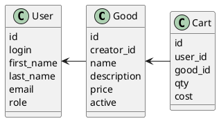

# Компонентная архитектура
<!-- Состав и взаимосвязи компонентов системы между собой и внешними системами с указанием протоколов, ключевые технологии, используемые для реализации компонентов.
Диаграмма контейнеров C4 и текстовое описание. 
-->
## Компонентная диаграмма

```plantuml
@startuml
!include https://raw.githubusercontent.com/plantuml-stdlib/C4-PlantUML/master/C4_Container.puml

AddElementTag("microService", $shape=EightSidedShape(), $bgColor="CornflowerBlue", $fontColor="white", $legendText="microservice")
AddElementTag("storage", $shape=RoundedBoxShape(), $bgColor="lightSkyBlue", $fontColor="white")

Person(admin, "Администратор")
Person(user, "Пользователь")

System_Ext(web_site, "Клиентский веб-сайт", "HTML, CSS, JavaScript, React", "Веб-интерфейс")

System_Boundary(conference_site, "Магазин") {
   Container(client_service, "Сервис авторизации", "C++", "Сервис управления пользователями", $tags = "microService")    
   Container(good_service, "Сервис товаров", "C++", "Сервис управдления товарами", $tags = "microService") 
   Container(cart_service, "Сервис корзины", "C++", "Сервис управления корзиной пользователя", $tags = "microService")  
   ContainerDb(db, "База данных", "MySQL", "Хранение данных о блогах, постах и пользователях", $tags = "storage")
   
}

Rel(admin, web_site, "Создание нового пользователя, поиск пользователя по логину, поиск пользователя по маске имя и фамилии, Создание товара")
Rel(user, web_site, "Получение списка товаров, добавление товара в корзину, получение корзины для пользователя")
Rel(web_site, client_service, "Работа с пользлвателем", "localhost/pres")
Rel(web_site, good_service, "Работа с товаром", "localhost/pres")
Rel(web_site, cart_service, "Работа с корзиной", "localhost/pres")
Rel(client_service, db, "INSERT/SELECT/UPDATE", "SQL")
Rel(good_service, db, "INSERT/SELECT/UPDATE", "SQL")
Rel(cart_service, db, "INSERT/SELECT/UPDATE", "SQL")

@enduml
```
## Список компонентов  

### Сервис авторизации
**API**:
-	Создание нового пользователя
      - входные параметры: login, пароль, имя, фамилия, email
      - выходные параметры: отсутствуют
-	Поиск пользователя по логину
     - входные параметры:  login
     - выходные параметры: имя, фамилия, email
-	Поиск пользователя по маске имени и фамилии
     - входные параметры: маска фамилии, маска имени
     - выходные параметры: login, имя, фамилия, email

### Сервис товара
**API**:
- Создание товара
  - Входные параметры: название товара, цена, описание
  - Выходыне параметры: карточка товара

### Сервис корзина
**API**:
- Добавдение товара
  - Входные параметры: карточка товара, количество
  - Выходные параметры: товар в корзине
- Просмотр корзины
  - Входные параметры: корзина пользователя
  - Выходные параметры: массив с выбранными товарами и количеством 


### Модель данных  
